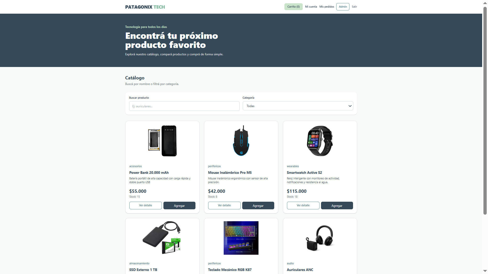
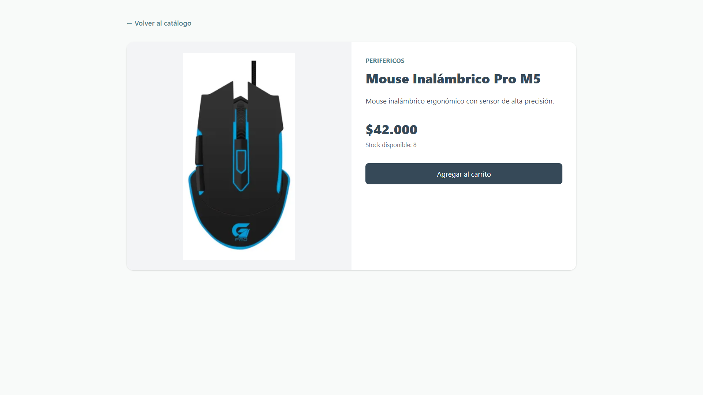
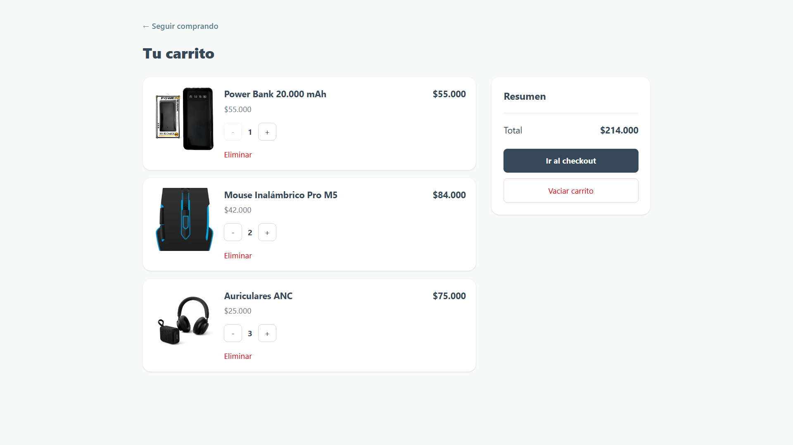
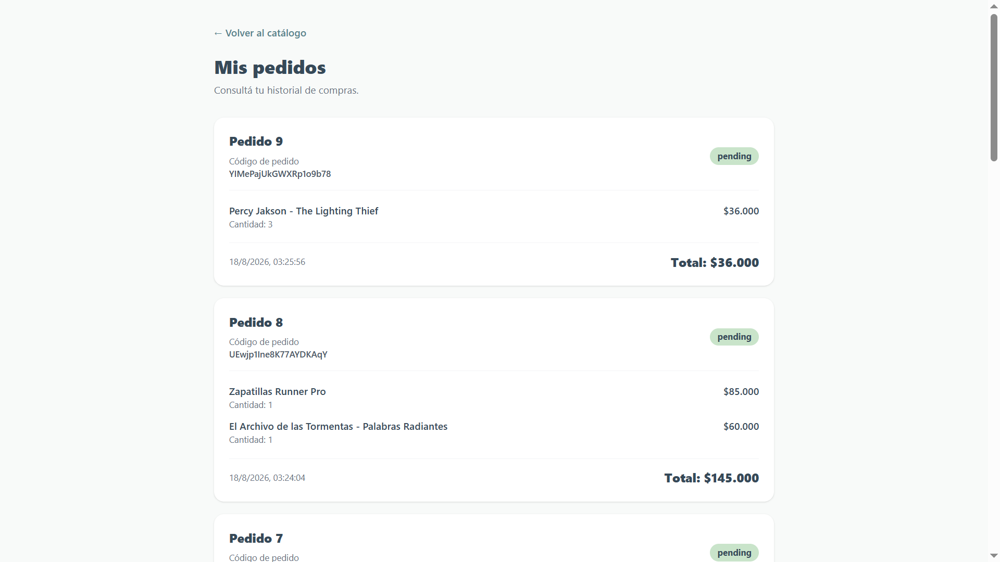
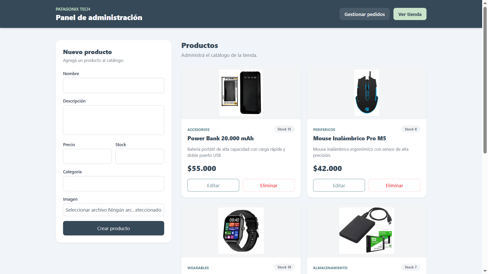
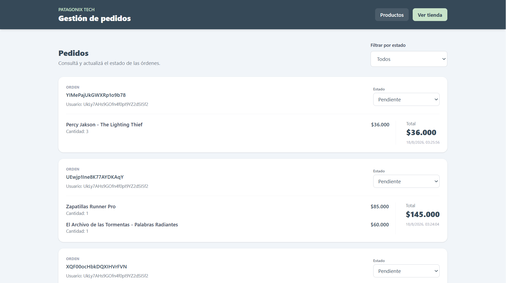
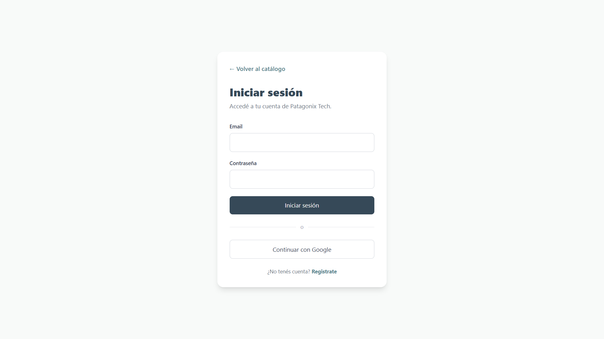
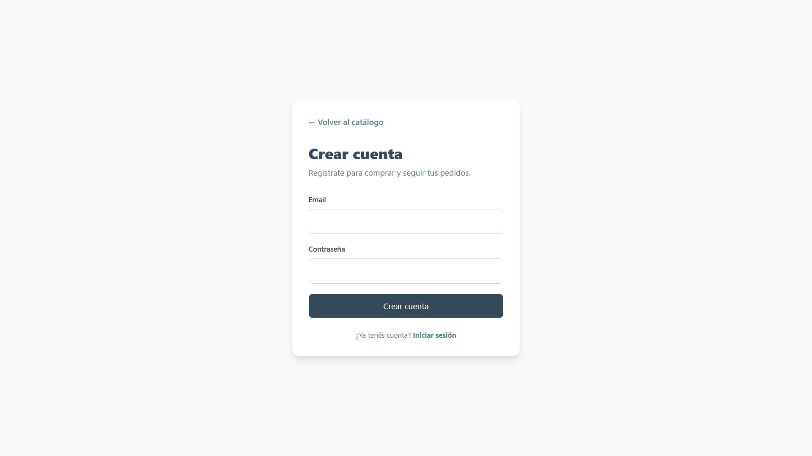

# Patagonix Tech - AI Driven E-Commerce

Aplicación web de e-commerce desarrollada con React, TypeScript, Firebase, AWS S3 y Vercel.

Permite explorar productos tecnológicos, administrar un carrito, realizar compras simuladas y consultar pedidos. También incluye un panel para administradores con gestión de productos, imágenes y órdenes.

---

## Aplicación desplegada

[Ver Patagonix Tech en producción](https://ai-driven-ecommerce-ft75.vercel.app/)

---

## Acceso de prueba

Para probar las funcionalidades de administrador:

```text
Email: dir1@gmail.com
Contraseña: 123456
Rol: admin
```

> Cuenta creada exclusivamente para demostración y evaluación académica.

Los usuarios registrados normalmente reciben el rol `customer`.

---

## Índice

- [Capturas de pantalla](#capturas-de-pantalla)
- [Funcionalidades](#funcionalidades)
- [Tecnologías utilizadas](#tecnologías-utilizadas)
- [Arquitectura del proyecto](#arquitectura-del-proyecto)
- [Decisiones arquitectónicas](#decisiones-arquitectónicas)
- [Flujo general](#flujo-general)
- [Subida de imágenes con AWS S3](#subida-de-imágenes-con-aws-s3)
- [Instalación local](#instalación-local)
- [Comandos disponibles](#comandos-disponibles)
- [Tests](#tests)
- [Seguridad](#seguridad)
- [Uso de inteligencia artificial](#uso-de-inteligencia-artificial)
- [Autores](#autores)

---

## Capturas de pantalla

### Catálogo principal



### Detalle de producto



### Carrito de compras



### Historial de pedidos



### Administración de productos



### Administración de pedidos



### Login



### Register



---

## Funcionalidades

### Cliente

- Registro con email y contraseña.
- Inicio de sesión con email o Google.
- Catálogo de productos.
- Búsqueda con debounce.
- Filtro por categoría.
- Detalle de producto.
- Carrito persistente por usuario.
- Control de cantidades según stock.
- Checkout simulado.
- Historial de pedidos.
- Feedback visual al agregar productos.

### Administrador

- Acceso restringido por rol.
- Crear, editar y eliminar productos.
- Subir imágenes desde la computadora.
- Gestionar stock.
- Consultar todos los pedidos.
- Filtrar órdenes por estado.
- Actualizar estados de pedidos.
- Feedback visual durante operaciones asincrónicas.

---

## Tecnologías utilizadas

### Frontend

- React
- TypeScript
- Vite
- React Router
- Tailwind CSS
- Context API
- useReducer

### Servicios

- Firebase Authentication
- Cloud Firestore
- AWS S3
- Vercel Functions
- AWS SDK

### Testing

- Vitest
- React Testing Library
- Testing Library User Event
- Jest DOM
- JSDOM

### Despliegue

- Vercel
- GitHub

---

## Arquitectura del proyecto

```text
ecommerce-ft75/
├── api/
│   └── s3-presign.ts
├── docs/
│   └── images/
│       ├── home.png
│       ├── product-detail.png
│       ├── cart.png
│       ├── orders.png
│       ├── admin-products.png
│       └── admin-orders.png
├── src/
│   ├── components/
│   ├── config/
│   │   └── firebase.ts
│   ├── contexts/
│   │   ├── AppProviders.tsx
│   │   ├── AuthContext.tsx
│   │   ├── ProductsContext.tsx
│   │   └── CartContext.tsx
│   ├── hooks/
│   ├── pages/
│   ├── reducers/
│   │   ├── cartReducer.ts
│   │   └── cartReducer.test.ts
│   ├── services/
│   │   ├── authService.ts
│   │   ├── userService.ts
│   │   ├── productService.ts
│   │   ├── orderService.ts
│   │   └── imageService.ts
│   ├── styles/
│   │   ├── globals.css
│   │   └── theme.css
│   ├── test/
│   │   └── setup.ts
│   └── types/
├── .env.example
├── package.json
├── vercel.json
├── vite.config.ts
└── vitest.config.ts
```

---

## Decisiones arquitectónicas

El proyecto se organizó separando responsabilidades:

- `pages/` contiene las pantallas principales.
- `components/` contiene elementos reutilizables.
- `contexts/` administra estados globales como autenticación, productos y carrito.
- `hooks/` simplifica el acceso a los contextos.
- `services/` concentra la comunicación con Firebase, Firestore y AWS.
- `reducers/` contiene la lógica del carrito.
- `types/` centraliza los modelos de TypeScript.

El flujo general sigue esta estructura:

```text
Interfaz
   ↓
Context / Hook
   ↓
Service
   ↓
Firebase / Firestore / AWS
```

El carrito utiliza `Context API + useReducer` y se almacena en `localStorage` utilizando una clave diferente para cada usuario.

Los pedidos guardan `priceAtPurchase` para conservar el precio histórico aunque el producto cambie posteriormente.

---

## Flujo general

1. El usuario se registra o inicia sesión mediante Firebase Authentication.
2. `AuthContext` mantiene la información de sesión y rol.
3. Los productos se obtienen desde Firestore.
4. El usuario puede buscar, filtrar y agregar productos al carrito.
5. El carrito se mantiene en Context y `localStorage`.
6. Al confirmar el checkout se crea una orden en Firestore.
7. El cliente puede consultar únicamente sus pedidos.
8. El administrador puede gestionar productos y actualizar estados de órdenes.

---

## Subida de imágenes con AWS S3

Las imágenes de los productos se almacenan en Amazon S3.

El flujo es:

```text
Administrador selecciona imagen
        ↓
imageService
        ↓
Firebase ID Token
        ↓
Vercel Function
        ↓
Presigned URL
        ↓
AWS S3
        ↓
imageUrl
        ↓
Firestore
```

La subida utiliza una Presigned URL para evitar exponer las credenciales privadas de AWS en el frontend.

La imagen puede seleccionarse desde cualquier ubicación de la computadora. Una vez subida, la aplicación utiliza la copia almacenada en S3.

---

## Instalación local

### 1. Clonar el repositorio

```bash
git clone REEMPLAZAR_CON_URL_DEL_REPOSITORIO
cd ecommerce-ft75
```

### 2. Instalar dependencias

```bash
npm install
```

### 3. Crear variables de entorno

Crear un archivo `.env` en la raíz utilizando `.env.example` como referencia.

```env
VITE_FIREBASE_API_KEY=
VITE_FIREBASE_AUTH_DOMAIN=
VITE_FIREBASE_PROJECT_ID=
VITE_FIREBASE_STORAGE_BUCKET=
VITE_FIREBASE_MESSAGING_SENDER_ID=
VITE_FIREBASE_APP_ID=

AWS_REGION=
AWS_S3_BUCKET=
AWS_ACCESS_KEY_ID=
AWS_SECRET_ACCESS_KEY=
```

Las credenciales privadas de AWS no deben guardarse en GitHub.

### 4. Ejecutar el proyecto

```bash
npm run dev
```

La aplicación estará disponible normalmente en:

```text
http://localhost:5173
```

---

## Comandos disponibles

### Desarrollo

```bash
npm run dev
```

### Tests

```bash
npm test
```

### Tests en modo observación

```bash
npm run test:watch
```

### Build de producción

```bash
npm run build
```

### ESLint

```bash
npm run lint
```

---

## Tests

El proyecto contiene pruebas de reducer, hooks, providers, componentes y servicios.

Resultado actual:

```text
Test Files  4 passed
Tests       6 passed
```

Se comprobaron comportamientos como:

- Agregar productos al carrito.
- Aumentar cantidades.
- Impedir cantidades superiores al stock.
- Obtener datos desde `AuthContext` mediante `renderHook`.
- Integración entre `CartPage`, `CartContext` y `cartReducer`.
- Subida de imágenes utilizando mocks para evitar conexiones reales con Firebase y AWS.

Los servicios externos son simulados durante los tests.

---

## Seguridad

- Las credenciales de AWS no se encuentran en el frontend.
- `.env` no se almacena en GitHub.
- Las imágenes se suben mediante Presigned URLs.
- Las rutas privadas requieren autenticación.
- Las rutas administrativas verifican el rol `admin`.
- Los nuevos usuarios reciben rol `customer`.
- Las reglas de Firestore limitan el acceso según usuario y rol.
- Los clientes solamente pueden consultar sus propios pedidos.
- Solamente los administradores pueden modificar productos y estados de órdenes.

---

# Uso de inteligencia artificial

La inteligencia artificial se utilizó como herramienta de apoyo durante el desarrollo.

Las propuestas fueron revisadas y comprobadas mediante ejecución local, tests y pruebas en producción.

---

## Caso 1: Paleta de colores

### Prompt

> `src/styles/theme.css`
>
> Tengo esta paleta de colores que saqué de una página que había recomendado el profe. No sé qué tan copada es para un e-commerce. ¿Tiene sentido?

### Respuesta de la IA

> La paleta puede funcionar, pero conviene utilizar fondos claros y reservar los colores oscuros para títulos, navegación y acciones principales.
>
> También se recomendó crear variables semánticas como `--background`, `--surface` y `--text-primary`.

### Descripción de lo sucedido

Se mantuvo la paleta original y se utilizaron los tonos más oscuros para elementos principales.

También se agregaron variables semánticas para facilitar el mantenimiento de los estilos.

---

## Caso 2: Feedback al agregar productos

### Prompt

> Cuando agrego algo al carrito no me doy cuenta de que pasó. El contador cambia arriba, pero es poco evidente. Podría aparecer un mensaje indicando qué producto agregué?

### Respuesta de la IA

> Se puede mostrar una notificación temporal tipo toast cada vez que se agrega un producto.

### Descripción de lo sucedido

Se agregó un toast tanto en el catálogo como en el detalle del producto.

Ejemplo:

```text
✓ Auriculares agregado al carrito
```

Esto permitió dar feedback inmediato sin modificar la lógica del reducer.

---

## Caso 3: Presentación de pedidos

### Prompt

> En Mis Pedidos aparece directamente el ID de Firestore como “Orden”. No seria mejor mostrar Pedido 1, Pedido 2 y dejar el ID como codigo de pedido?

### Respuesta de la IA

> El identificador técnico puede conservarse como información secundaria y utilizar un nombre más simple como título de cada pedido.

### Descripción de lo sucedido

Se mantuvo el ID real de Firestore, pero la interfaz pasó a mostrarlo como `Código de pedido`.

Los pedidos se presentan visualmente como `Pedido 1`, `Pedido 2`, etc.

---

## Caso 4: Imágenes recortadas

### Prompt

> Algunas imagenes de productos se ven recortadas dependiendo de sus proporciones. como podria hacer para mostrar la imagen completa?

### Respuesta de la IA

> `object-cover` llena todo el contenedor pero puede recortar la imagen. Para productos puede ser más apropiado utilizar `object-contain`.

### Descripción de lo sucedido

Se reemplazó `object-cover` por `object-contain` en las principales vistas de productos.

Esto permitió mostrar cada imagen completa independientemente de sus proporciones.

---

## Caso 5: Estado de carga al guardar productos

### Prompt

> Cuando el administrador crea un producto con imagen puede demorar y parece que el boton no hizo nada. podemos mostrar un spinner o “Agregando producto...” para evitar que lo apriete varias veces?

### Respuesta de la IA

> Se puede utilizar un estado `saving`, mostrar un spinner y deshabilitar temporalmente el botón mientras termina la operación asincrónica.

### Descripción de lo sucedido

Se agregó feedback visual para creación y edición:

```text
Agregando producto...
Actualizando producto...
```

Durante la operación el botón permanece deshabilitado, evitando acciones duplicadas.

---

## Decisiones y validación de las respuestas de IA

Las respuestas de IA no fueron aplicadas automáticamente.

Cada propuesta fue:

1. Revisada.
2. Adaptada al proyecto.
3. Probada localmente.
4. Verificada con tests cuando correspondía.
5. Comprobada en producción.

La inteligencia artificial se utilizó como asistente durante el desarrollo, mientras que las decisiones y validaciones finales fueron realizadas por el equipo.

---

## Autor
- Leonel Gabriel Bruno Vera